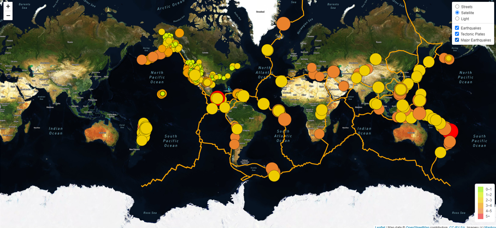
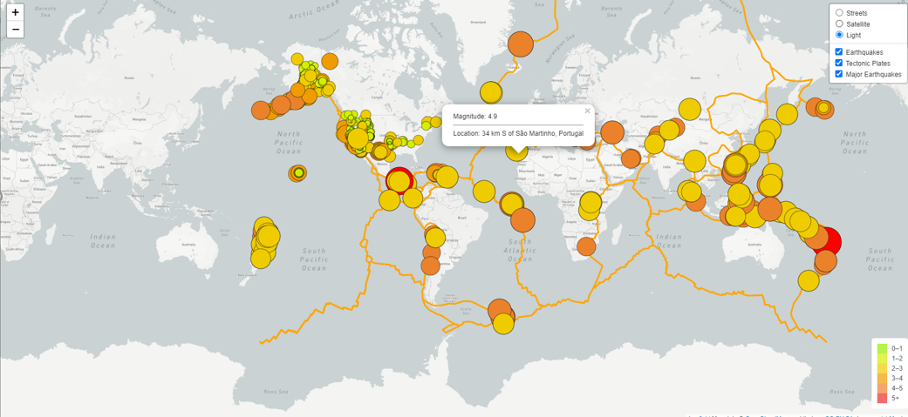
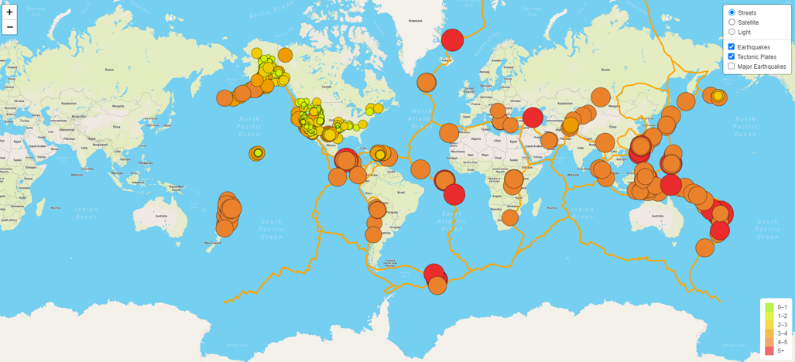

## An interactive world map of earthquakes - Mapping_Earthquakes
## Purpose:
Using Leaflet.js API to populate a geographical map with GeoJSON earthquake data from a URL. Each earthquake will be visually represented by a circle and color, where a higher magnitude will have a larger diameter and will be darker in color. Each earthquake will have a popup marker that, when clicked, will show the magnitude of the earthquake and the location of the earthquake. 
Using a URL for GeoJSON earthquake data from the USGS website retrieve geographical coordinates and the magnitudes of earthquakes, major earthquakes and tectonic plates and adding the data to a map is the main purpose of the project.
### Tools: 
JavaScript, HTML and CSS languages and the D3.js librarr to retrieve the coordinates and magnitudes of the earthquakes from the GeoJSON data. Leaflet library to plot the data on a Mapbox map through an API request and create interactivity for the earthquake data. a URLs for GeoJSON earthquake data from the USGS website and tectonic json data. Code is written in VSCode and tested in Chrome Developer Tools. I used the following data sources:

https://github.com/fraxen/tectonicplates/tree/master/GeoJSON

https://earthquake.usgs.gov/earthquakes/feed/v1.0/summary/all_week.geojson

https://earthquake.usgs.gov/earthquakes/feed/v1.0/summary/4.5_week.geojson

## Analysis:
In this project I used data provided by U.S. Geological Survey to create a visulaization of world map earthquake data by latitude and longitude and created sophisticated plots and completed the following: 
- Retrieve data from a GeoJSON file
- Make API requests to a server to host geographical maps
- Populate geographical maps with GeoJSON data using JavaScript and the Data-Driven Documents (D3) library
- Add multiple map layers to geographical maps using Leaflet control plugins to add user interface controls
- Use JavaScript ES6 functions to add GeoJSON data, features, and interactivity to maps
- Render maps on a local server
- Three different map styles:
    - Street view
    - Satellite view
    - Light view
- Switch on/off button 
    - for fault lines of tectonic plates
    - for all earthquakes of the past 7 days
    - for major earthquakes 

## Summary:
In summary this project is a data-driven storytelling on disasters around the world and creating awareness of eartqueakes. It gives information about the location and magnitude of earthquakes. The diameter and the color of a marker reflects the strength of the earthquake.
